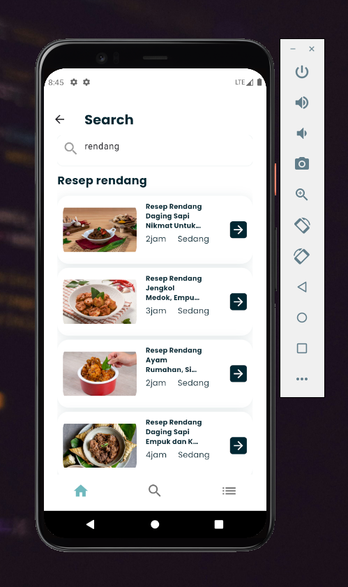
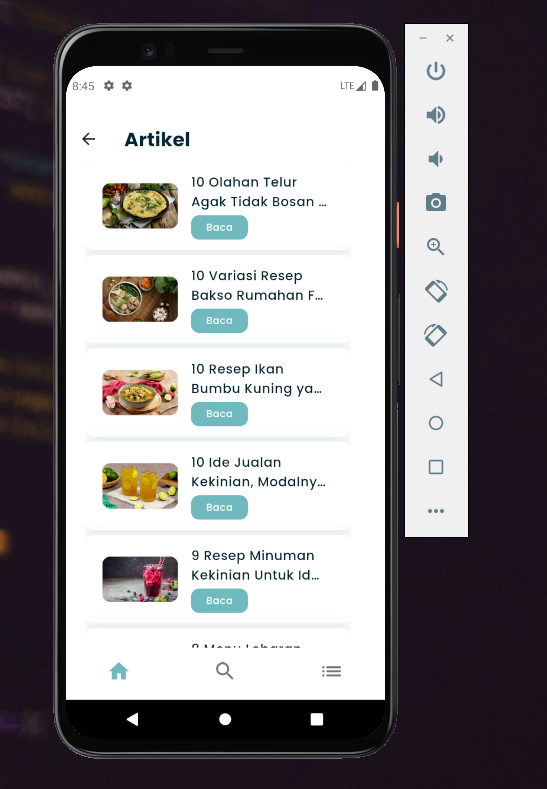

# masakyuk

Aplikasi resep makanan indonesia.
[API](https://github.com/dhino12/unofficial-masakapahariini-api)
[FIGMA](https://www.figma.com/design/s8HvEH4uMeXNdmCvTeBCFb/yukMasak?node-id=0-1&node-type=canvas&t=TjVEbHfi5zpCKr7w-0)

## Screenshot

